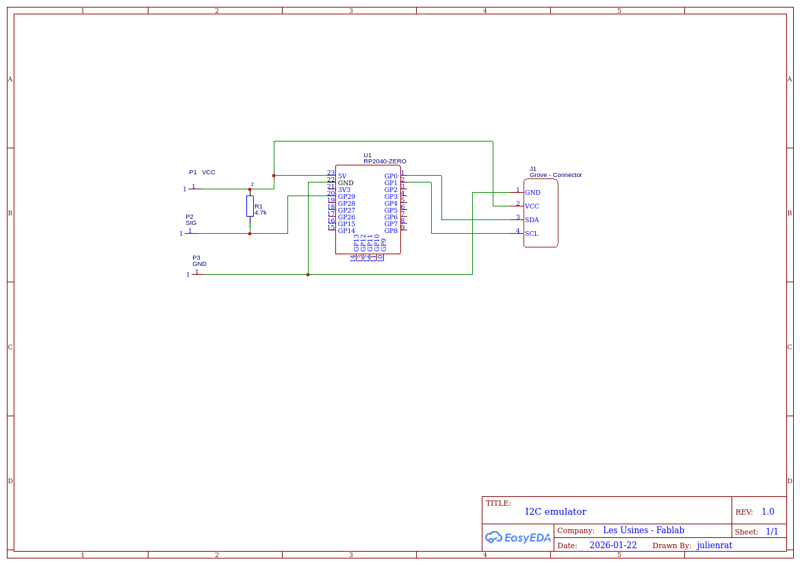
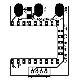
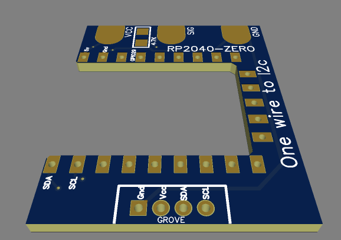

# I2C_DS18B20_to_MCP9808

Emulateur I2C du capteur **MCP9808** basé sur un **DS18B20**. Le microcontrôleur (RP2040) expose un périphérique I2C à l’adresse `0x18` et fournit la température via le registre `0x05` comme un MCP9808.

## Aperçu
- Le DS18B20 est lu **toutes les 2 minutes**.
- La valeur est convertie au format MCP9808 (0.0625°C par LSB).
- Un master I2C peut lire la température via le registre `0x05`.
- LED NeoPixel utilisée comme indicateur d’état.

## Matériel
- Carte RP2040 (Pico / RP2040 Zero compatible)
- Capteur DS18B20 (1-Wire)
- 1x résistance 4.7 kΩ (pull-up DATA)
- 1x NeoPixel (WS2812)

## Câblage
- DS18B20 DATA -> `GPIO29`
- DS18B20 VCC -> `3.3V`
- DS18B20 GND -> `GND`
- Résistance 4.7 kΩ entre DATA et 3.3 V
- NeoPixel DIN -> `GPIO16`
- NeoPixel VCC -> `3.3V` (ou 5V si votre LED l’exige, **avec niveau logique adapté**)
- NeoPixel GND -> `GND`
- I2C SDA/SCL selon la carte et votre câblage (le périphérique répond à `0x18`)

## Illustrations
### Schéma


### PCB 2D


### PCB 3D


## Dépendances (PlatformIO)
Déjà déclarées dans `platformio.ini` :
```
lib_deps =
    milesburton/DallasTemperature
    paulstoffregen/OneWire
    FastLED
```

## Fonctionnement I2C (émulation MCP9808)
- Adresse I2C : `0x18`
- Registre température ambiante : `0x05`
- Format registre `0x05` : 12 bits de température, 0.0625°C/LSB

Le code renvoie un registre 16 bits (MSB puis LSB) comme un MCP9808.

## LED NeoPixel (GPIO16)
- **Violet** : mesure DS18B20 en cours (toutes les 2 minutes)
- **Vert** : lecture I2C du registre température (pulse 500 ms)
- **Rouge clignotant** : erreur de lecture DS18B20 (500 ms on/off)
- **Éteinte** : pas d’activité

## Notes importantes
- La mesure DS18B20 est **indépendante** des requêtes I2C et se fait toutes les 2 minutes.
- Lorsqu’un master lit `0x05`, la valeur renvoyée est la **dernière mesure disponible**.

## Dépannage
- Si la LED clignote rouge : vérifier câblage DS18B20 et la résistance de pull-up.
- Si aucune température n’est lue : vérifier `GPIO29` et l’alimentation du capteur.

## Structure du projet
- Code principal : `src/main.cpp`
- Configuration PlatformIO : `platformio.ini`
